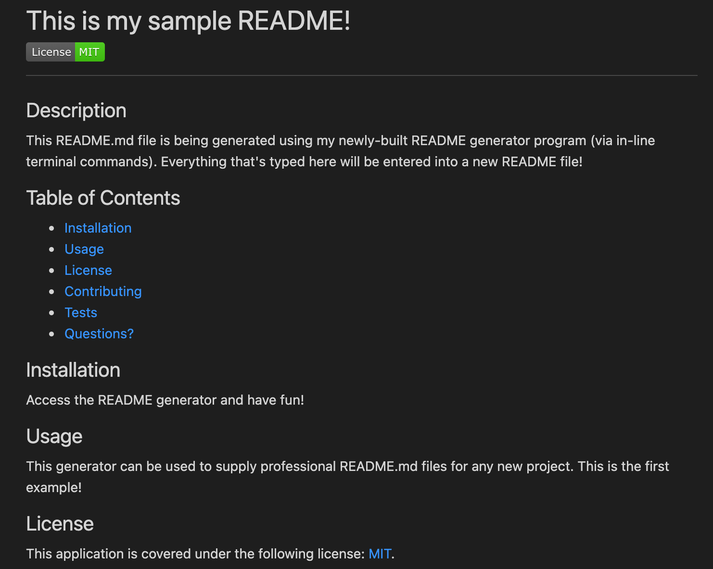

# README-Generator

## Bootcamp homework #7

A developer requires a README.md file generator so that they can quickly and easily create professional READMEs for new projects. The following "Acceptance Criteria" for this feature were requested and have now been implemented:

- A command-line application was created which accepts user input
- Responses generated by the command-line application complete and/or generate the following README sections:

* Project title
* Description
* Table of Contents (pre-established; links all following sections from near top of page)
* Installation
* Usage
* License
* Contributing
* Tests
* Questions

- A license badge and accompanying link are generated using ChooseALicense.com and shields.io based on which license the README falls under (user-chosen).
- A GitHub username and profile page link are provided for users to contact the README author.

Additionally, a video walk-through highlighting the program's functionality has been created and linked (below) and the Javascript includes comments.

## README Generator -- File screenshot

The following is a screenshot of a completed README.md file generated using this program, highlighting the program's appearance and functionality:

## Link to README.md file completed using generator

A link to the above README.md file is available here: https://github.com/L-Buchholz/readme-generator/blob/main/user_README.md

## Link to video walk-through of README file generator

As the README generator cannot be deployed at a live URL, a video highlighting a walk-through of using this generator is included here: https://drive.google.com/file/d/1lWzxJQ53hvwlWd-AQWK2m5y4uvP3oruP/view?usp=sharing
